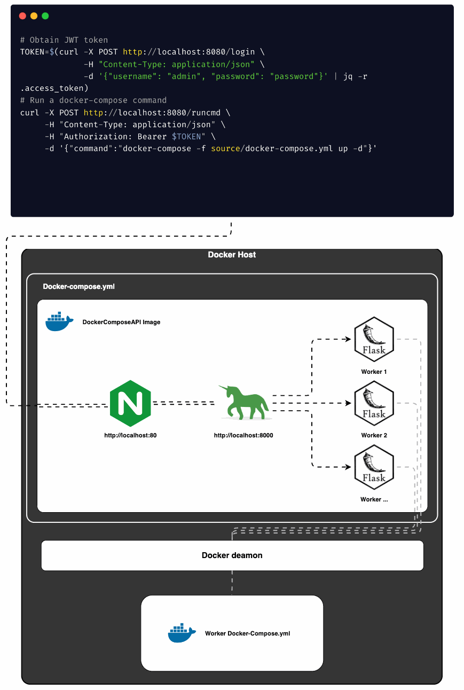
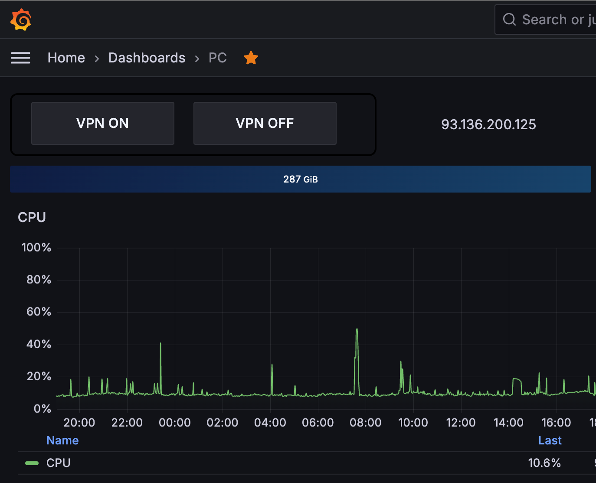

# DockerComposeAPI

This repository contains a Dockerized Flask application running behind Gunicorn and Nginx.

## Overview

This application is designed to interact with `docker-compose` commands using RESTful APIs. It allows users to run `docker-compose` commands, view the output, and execute multiple commands in sequence.



## Use case

### Scenario:
You have a machine running services in Docker containers that need to be up and running all the time. Occasionally, you require additional services that are not needed constantly, such as a VPN service. With the Docker-Compose API, you can manage these additional services remotely through a simple interface.

### Example:
Imagine you have a Grafana dashboard monitoring your system's performance and network traffic. You need to enable or disable a VPN service on-demand to secure your network traffic during specific operations or troubleshooting sessions.



### Implementation:
1. **Setup the Docker-Compose API**:
   - Ensure the Docker-Compose API is running on your remote machine.
   - Configure the API to manage your Docker services.
2. **Integrate with Grafana**:
   - Add a button on your Grafana dashboard to control the VPN service.
   - Use the Docker-Compose API to start and stop the VPN service with the button press.

### Architecture

- **Flask API**: The API provides endpoints for interacting with `docker-compose` commands.
- **Gunicorn**: The Flask application runs behind Gunicorn, a Python WSGI server.
- **Nginx**: Nginx acts as a reverse proxy server, routing incoming requests to the Gunicorn server.

### Prerequisites

- [Docker](https://www.docker.com/get-started)
- [Docker Compose](https://docs.docker.com/compose/install/)

### Running the Application

To run the application, follow these steps:

1. **Build the Docker image:**
   ```bash
   docker compose build
   ```
2. **Configure docker-compose.yaml:**
   Open the docker-compose.yaml file and modify the volumes. 
   By default, the API will start the Hello World docker container for testing.
   ```bash
   ...
   volumes:
     - /var/run/docker.sock:/var/run/docker.sock:ro
     - ./test:/app/source/ #Add your docker-compose.yml source directory here.
   ...
   ```
   Create .env file for storing variables.
   ```bash
   MY_JWT_SECRET_KEY=your_default_jwt_secret_key # Create JWT secret key woth SSL command (openssl rand -hex 32)
   API_USERNAME=admin
   API_PASSWORD=password
   ```
3. **Run the Docker container in detached mode:**
   ```bash
   docker compose up -d
   ```

Once the container is running, you can access the API at `http://localhost:8080`.

### API Endpoints

The application provides the following endpoints:

- **POST `/login`**: Authenticate with a username and password (`admin`/`password`).
- **POST `/runcmd`**: Run a `docker-compose` command. The command must start with `docker-compose`.

#### Example usage:

```bash
# Obtain JWT token
TOKEN=$(curl -X POST http://localhost:8080/login \
             -H "Content-Type: application/json" \
             -d '{"username": "admin", "password": "password"}' | jq -r .access_token)

# Run a docker-compose command
curl -X POST http://localhost:8080/runcmd \
     -H "Content-Type: application/json" \
     -H "Authorization: Bearer $TOKEN" \
     -d '{"command":"docker-compose -f source/docker-compose.yml up -d"}'
```

### Security

The application uses JSON Web Tokens (JWT) for authentication and authorization. Access tokens are generated upon successful login and must be included in the `Authorization` header of each request.

### Additional Information

- **Configuration**: Ensure your `docker-compose.yml` and environment variables are properly configured before starting the application.
- **Logging**: Logs can be accessed through Docker logs for debugging and monitoring.
  ```bash
  docker logs docker_compose_api
  ```

For more details, please refer to the official [Docker Compose documentation](https://docs.docker.com/compose/).
